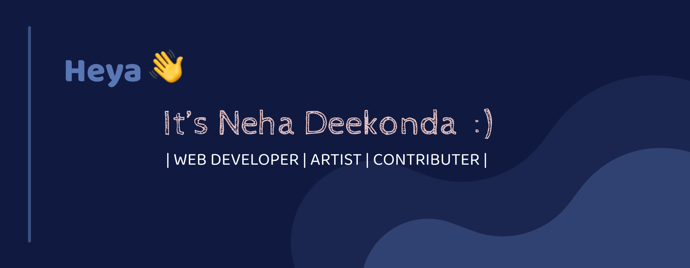

<!------------------->
<h1>About me:</h1>
<h3>
- 👋 Hi, I’m Neha Deekonda 
- 😇 Studying in SVNIT 
- 👀 I’m interested in Web Development. 
- 🌱 I’m currently learning MERN. 
- 💞️ I’m looking forward to collaborate in open source projects. 
- 📫 How to reach me nehadeekonda9849@gmail.com
</h3>

<h1>Languages and Tools Known:</h1>

<code></code>&nbsp;&nbsp;
<code></code>&nbsp;&nbsp;
<code></code>&nbsp;&nbsp;
<code></code>&nbsp;&nbsp;
<code></code>&nbsp;&nbsp;
<code></code>&nbsp;&nbsp;
<code></code>&nbsp;&nbsp;
<code></code>&nbsp;&nbsp;
<code></code>&nbsp;&nbsp;
<code></code>&nbsp;&nbsp;

<!----------------->
<h2 align="center">Git Stats✨</h2>

<!---------------------->
